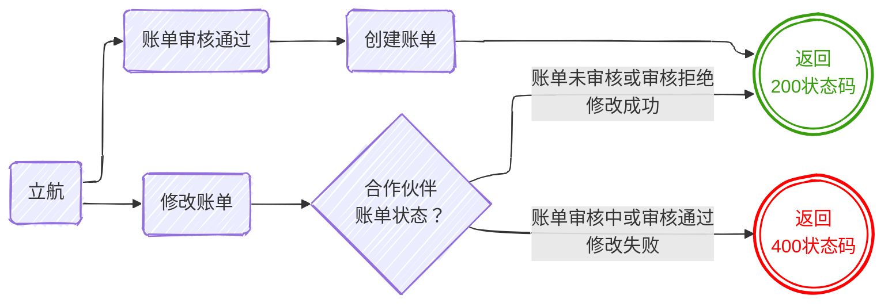

## 更新日志

| 版本  | 修改描述     | 修订人 |  修订时间  |
| :---: | ------------ | ------ | :--------: |
| 1.0.0 | 新增规范文档 | 赖钻   | 2026-04-28 |

## 账单推送 {#bill-day-pull}

立航财务对系统生成的日账单审核通过后，系统会自动将账单推送至合作伙伴指定系统。在合作伙伴没有对该账单进行审核之前，立航可能会多次调用接口对账单进行修改。每次修改立航会推送账单的全量数据




### 请求参数

:::details 点击查看

```json
{
  "billNo": "DAR260425-00051",
  "billType": "OUTBD",
  "orderNo": "OE2604248768",
  "billDate": "2026-04-25",
  "payerCode": "xxx",
  "remark": "xxxx",
  "data": {
    "containerNo": "WHSU5690029",
    "warehouseCode": "QY"
  },
  "items": [
    {
      "id": "1EJqLM157rV",
      "feeCode": "CODE1",
      "feeName": "港口设施保安费",
      "amount": 150.00,
      "remark": "港口设施保安费-40-45尺柜(东部码头)",
      "status": "PENDING"
    },
    {
      "id": "Y1q4mkRao1b",
      "feeCode": "CODE2",
      "feeName": "过磅费",
      "amount": 1200.00,
      "remark": "入仓过磅费",
      "status": "PENDING"
    }
  ]
}
```

:::

### 请求方法

接口地址由合作伙伴提供。立航会通过`POST`方法调用接口，`Content-Type`为 `application/json`

### 请求参数

| **字段名称** | **字段描述** | **数据类型** | **详细说明**                                                 | **必填** |
| ------------ | ------------ | ------------ | ------------------------------------------------------------ | :------: |
| billNo       | 账单号       | String(20)   | 系统唯一单号，相同单号请求说明是修改操作                     |    Y     |
| billType     | 账单类型     | Enum         | `OUTBD`: 出库账单 <br> `SAT-OUTBD`：网点出库账单             |    Y     |
| orderNo      | 业务单号     | String(20)   | `OUTBD`：出库单号<br>`SAT-OUTBD`：卫星账单号                 |    Y     |
| billDate | 账单日期     | Date         | `OUTBD`：出库订单锁封日期<br>`SAT-OUTBD`：入仓费用为卫星仓入仓登记日期，出仓费用为卫星仓出仓发运日期 |    Y     |
| payerCode    | 分公司代码   | String(30)   |                                                              |    Y     |
| data     | 业务数据       |   Object   |          不同账单类型内容不同 <br/>     [OUTBD：出库账单](#outbd-data)<br/>[SAT-OUTBD：卫星仓账单](#sat-outbd-data)                                              |    Y      |
| remark | 账单备注 | String(200) |  | N |
| items | 账单明细 | [List(1...n)](#fee-item) |  | Y |

#### 出库账单业务数据 {#outbd-data}

| **字段名称**  | **字段描述** | **数据类型** | **详细说明**   | **必填** |
| ------------- | ------------ | ------------ | -------------- | :------: |
| containerNo   | 柜号         | String(11)   |                |    Y     |
| warehouseCode | 仓库代码     | String(6)    | [深圳仓仓库代码](./basic-data#warehouseCode) |    Y     |

#### 卫星仓账单业务数据 {#sat-outbd-data}

| **字段名称** | **字段描述** | **数据类型** | **详细说明**                                     | **必填** |
| ------------ | ------------ | ------------ | ------------------------------------------------ | :------: |
| satWhseCode  | 仓库代码     | String(6)    | [卫星仓仓库代码](./basic-data#sateWarehouseCode) |    Y     |

#### 账单费用明细 {#fee-item}

| **字段名称**     | **字段描述** | **数据类型** | **详细说明**                                     | **必填** |
| ---------------- | ------------ | ------------ | ------------------------------------------------ | :------: |
| id | 费用明细ID | String(32)  | 全局唯一ID |    Y     |
| feeCode | 费用代码 | String(20) |  | Y |
| feeName | 费用名称 | String(100) |  | Y |
| amount | 金额 | Float(10,2) | 立航应收金额 | Y |
| remark | 备注 | String(200) |  | N |
| status | 费用明细审核状态 |  <Tip text="Enum">APPROVED：审核通过<Br/>REJECTED：审核拒绝<Br/>PENDING：待审核</Tip> | 创建的时候都是`PENDING`，修改会保留合作伙伴对这条费用的审核状态 | Y |

## 账单审核回执

合作伙伴对立航推送的日账单明细进行审核，将审核结果通过此接口反馈给立航。立航相关工作人员会针对此次的审核结果进行修订，并重新调用[账单推送接口](#bill-day-push)

### 请求方法

`POST`：`/v1/daily-bills/audit`

### 请求参数

:::details 点击查看

```json
{
  "billNo": "DAR260425-00051",
  "auditStatus": "REJECTED",
  "reason": "详见费用明细审核结果",
  "auditBy": "张三",
  "auditContact": "18982738821",
  "items": [
    {
      "id": "1EJqLM157rV",
      "auditStatus": "REJECTED",
      "reason": "金额有误"
    },
    {
      "id": "Y1q4mkRao1b",
      "auditStatus": "APPROVED"
    }
  ]
}
```

:::

### 请求参数

| **字段名称** | **字段描述**   | **数据类型**                                                 | **详细说明**                             | **必填** |
| ------------ | -------------- | ------------------------------------------------------------ | ---------------------------------------- | :------: |
| billNo       | 账单号         | String(20)                                                   | 系统唯一单号，相同单号请求说明是修改操作 |    Y     |
| auditStatus  | 审核状态       | <Tip text="Enum">APPROVED：审核通过<Br/>REJECTED：审核拒绝</Tip> | 所有费用都是`APPROVED`账单才能`APPROVED` |    Y     |
| reason       | 审核拒绝内容   | String(200)                                                  | `REJECTED`状态下必填                     |    O     |
| auditBy      | 审核人名称     | String(20)                                                   |                                          |    N     |
| auditContact | 审核人联系方式 | String(100)                                                  | 审核人联系电话或者联系邮箱               |    Y     |
| items        | 审核费用明细   | [List(1...n)](#audit-item)                                   |                                          |    Y     |

#### 审核费用明细 {#audit-item}

| **字段名称** | **字段描述** | **数据类型**                                                 | **详细说明**               | **必填** |
| ------------ | ------------ | ------------------------------------------------------------ | -------------------------- | :------: |
| id           | 费用明细ID   | String(32)                                                   | 对应推送账单接口中明细的ID |    Y     |
| auditStatus  | 费用审核状态 | <Tip text="Enum">APPROVED：审核通过<Br/>REJECTED：审核拒绝</Tip> |                            |    Y     |
| reason       | 审核拒绝内容 | String(200)                                                  | `REJECTED`状态下必填       |    O     |