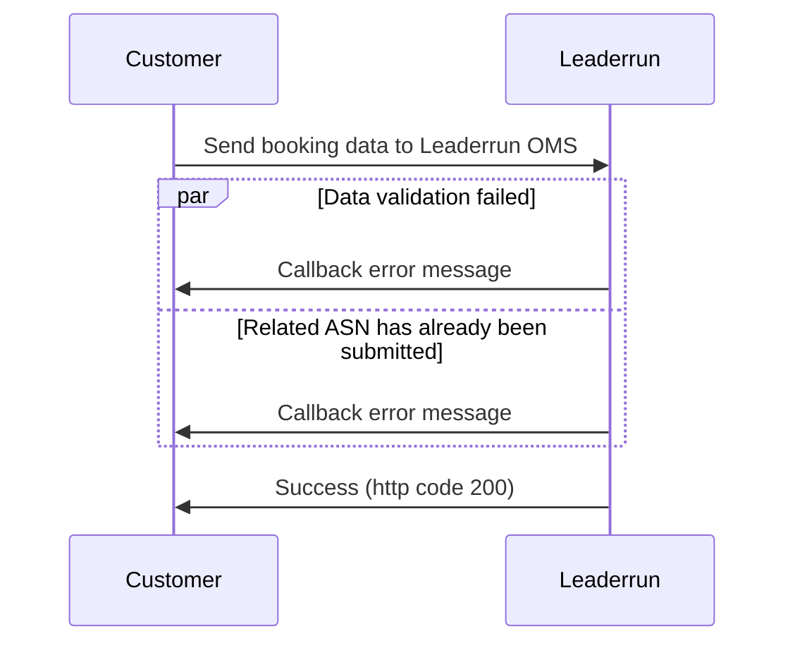
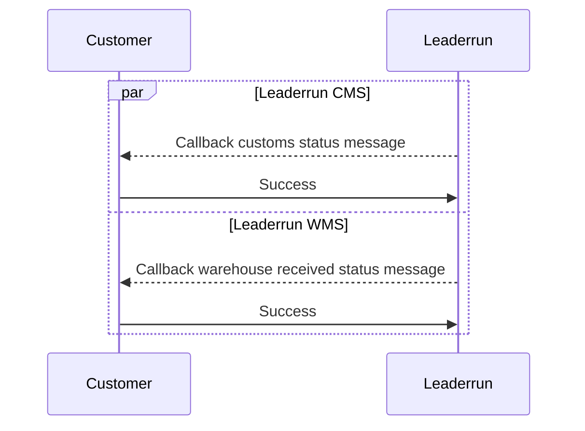

> [!danger] 提示
> :warning: 您当前访问的文档为归档状态，立航不再为其提供支持！

## 更新日志

| 版本  | 修改描述     | 修订人 |  修订时间  |
| :---: | ------------ | ------ | :--------: |
| 1.0.0 | 新增规范文档 | 赖钻   | 2023-10-08 |
| 1.0.0 | 归档         | 赖钻   | 2025-04-29 |

## 创建 Booking

客户通过接口的方式在立航系统中创建 Booking 订单

#### 数据流转



#### 请求路径

`/v1/inbound/booking`

#### 请求方法

`POST`

#### 请求参数

| **字段名称**          | **字段描述**   | **数据类型** | **详细说明**                                                                                                                            | **必填** |
| --------------------- | -------------- | ------------ | --------------------------------------------------------------------------------------------------------------------------------------- | :------: |
| soNum                 | 装运订单号     | String(32)   | Booking Number                                                                                                                          |    Y     |
| shipperName           | 发货人名称     | String(30)   | 工厂名                                                                                                                                  |    N     |
| goodsName             | 货物简称       | String(100)  | 装运的货物简要描述                                                                                                                      |    N     |
| warehouseCode         | 交仓仓库代码   | String(10)   | 对应立航仓库代码。[监管仓代码表](#warehouseCode)、[保税区仓库代码表](#bsWarehouseCode)                                                  |    N     |
| receiverName          | 收货人名称     | String(30)   | 收货人名称                                                                                                                              |    N     |
| contactPerson         | 联系人         | String(30)   | Booking 对应货代联系人.                                                                                                                 |    N     |
| contactPersonEmail    | 联系人电子邮件 | String(120)  | Booking 对应货代联系人邮箱.                                                                                                             |    N     |
| contactNumber         | 联系电话       | String(30)   | Booking 对应货代联系人电话.                                                                                                             |    N     |
| consigneeCode         | 收货方代码     | String(30)   | 此 CODE 用于识别该 Booking 在立航属于哪个收货方,需双方一同建立对应关系.                                                                 |    Y     |
| payerCode             | 分公司         | String(30)   | 此 CODE 用于识别 BOOKING 属于哪个分公司,如果收货方有绑定固定分公司则不需要提供,反之需要提供分公司,以便后续立航对应分公司账单数据的产生. |    N     |
| satWhseCode           | 卫星仓代码     | String(6)    | 用于判断卫星仓业务,以便卫星仓业务的流转运作.以下为立航目前现有的卫星仓已经对应 CODE. [卫星代码表](#sateWarehouseCode)                   |    N     |
| monthlySettlement     | 账单月结       | Boolean      | 用于标记该 Booking 费用是否月结,用于个别 Booking 原合同是现金,但个别单据需要月结的场景.                                                 |    N     |
| totalPackages         | 总件数         | Int          | 若没提供 PO,ITEM 明细,则必需提供总包装数                                                                                                |    Y     |
| packageUnit           | 包装单位       | String(30)   | 若没提供 PO,ITEM 明细,则必需提供包装单位。[包装单位](#warehousePackageCode)                                                             |    Y     |
| totalCartons          | 总箱数         | Int          | 若没提供 PO,ITEM 明细,且在包装数为板或 PKG 时,提供总箱数                                                                                |    N     |
| totalGrossWeight      | 总毛重         | Float(10,4)  | 若没提供 PO,ITEM 明细,则必需提供 Booking 总毛重                                                                                         |    Y     |
| totalVolume           | 总体积         | Float(4,4)   | 若没提供 PO,ITEM 明细,则必需提供 Booking 总体积                                                                                         |    Y     |
| destinationCountry    | 目的国         | String(3)    | 提供 Booking 目的国                                                                                                                     |    Y     |
| destinationPort       | 目的港         | String(10)   | 提供 Booking 目的港                                                                                                                     |    Y     |
| deliveryStartDate     | 交仓开日日期   | String       | 提供 Booking 预计交仓日期。格式：yyyy-MM-dd'T'HH:mm:ss                                                                                  |    N     |
| deliveryCutoffDate    | 交仓截止日期   | String       | 提供 Booking 交仓截止日期。格式：yyyy-MM-dd'T'HH:mm:ss                                                                                  |    N     |
| mark                  | 唛头           | String(200)  | 提供唛头信息                                                                                                                            |    N     |
| remark                | 备注           | String(200)  | 提供个别备注                                                                                                                            |    N     |
| purchaseOrders        | 采购订单       | List(0..n)   | Po 明细清单                                                                                                                             |    N     |
| Purchase Order Object |                |              |                                                                                                                                         |    N     |
| poNum                 | 采购订单号     | String(32)   | Po Number                                                                                                                               |    Y     |
| items                 | 项目           | List(0..n)   | Item 明细清单                                                                                                                           |    Y     |
| Item Object           |                |              |                                                                                                                                         |    N     |
| itemNum               | 项目编号       | String(32)   | Item number.                                                                                                                            |    Y     |
| packingUnit           | 包装单位       | String(20)   | 包装单位· CTN (Carton)· PLT (Pallet)                                                                                                    |    Y     |
| quantity              | 包装数量       | Integer      | 包装数量                                                                                                                                |    Y     |
| grossWeight           | 毛重 (公斤)    | Float(10,4)  | 毛重.最大两位数.                                                                                                                        |    Y     |
| volume                | 体积 (立方米)  | Float(4,4)   | 体积.最大两位数.                                                                                                                        |    Y     |

#### JSON Example

```json
{
  "soNum": "MNSPAN0000800045",
  "shipperName": "ABC Company",
  "goodsName": "头发纤维+塑料喷头",
  "warehouseCode": "PLA",
  "receiverName": "CBA Company",
  "contactPerson": "David Lee",
  "contactPersonEmail": "david.lee@xxx.com",
  "contactNumber": "13813561378",
  "consigneeCode": "ADIDAS",
  "payerCode": "SZX",
  "satWhseCode": "ZSN",
  "monthlySettlement": true,
  "totalPackages": "6",
  "packageUnit": "PLT",
  "totalCartons": "60",
  "totalGrossWeight": "100",
  "totalVolume": "19.28",
  "destinationCountry": "USA",
  "destinationPort": "USLSA",
  "deliveryStartDate": "2023-10-07T17:30:29",
  "deliveryCutoffDate": "2023-10-15T17:30:29",
  "mark": "2011790464/2011790465",
  "remark": "正面朝上",
  "purchaseOrders": [
    {
      "poNum": "2011790464",
      "items": [
        {
          "itemNum": "07415661",
          "packingUnit": "PLT",
          "quantity": 2,
          "grossWeight": 20.5,
          "volume": 5.82
        },
        {
          "itemNum": "07415662",
          "packingUnit": "PLT",
          "quantity": 1,
          "grossWeight": 19.5,
          "volume": 2.82
        }
      ]
    },
    {
      "poNum": "2011790465",
      "items": [
        {
          "itemNum": "07415663",
          "packingUnit": "PLT",
          "quantity": 1,
          "grossWeight": 19.48,
          "volume": 2.82
        },
        {
          "itemNum": "07415664",
          "packingUnit": "PLT",
          "quantity": 2,
          "grossWeight": 40.52,
          "volume": 7.82
        }
      ]
    }
  ]
}
```

#### 响应

立航系统返回`HTTP`状态码为`204`的时候表示订单创建成功

### Booking 事件反馈

立航系统将 Booking 事件实时反馈给客户系统。**客户可以自定义需要接收哪些事件，以及事件相应数据的回推**

#### 数据流转



#### 请求路径

客户提供

#### 请求方法

`POST`

#### 请求参数

| **字段名称** | **字段描述**   | **数据类型**  | **详细说明**                                                            | **必填** |
| ------------ | -------------- | ------------- | ----------------------------------------------------------------------- | :------: |
| event        | 事件           | String        | `approved\arrived\released\inspection\received`。[事件详细说明](#Event) |    Y     |
| eventTime    | 事件产生的时间 | LocalDateTime | 事件产生的时间                                                          |    Y     |
| eventNote    | 时间描述       | String        | 事件详细描述                                                            |    N     |
| data         | 数据回执       | [Data](#Data) | 事件节点产生的数据                                                      |    Y     |

##### Data

不同节点`Data`节点的内容可能会不一致。事件没涉及到的`Data`节点则表明这个时间没有其它额外的数据。

- `approved`/`arrived`/`released` 事件

  | **字段名称** | **字段描述**                               | **数据类型**          | **必填** |
  | ------------ | ------------------------------------------ | --------------------- | -------- |
  | asnNo        | Asn 单号                                   | String                | Y        |
  | carPlateNo   | 车牌号(`approved`和`released`事件该值为空) | String                | N        |
  | packageUnit  | 报关包装单位                               | `CTN\PLT\OTH`         | Y        |
  | items        | Asn 报关资料关联的明细数据                 | [`List<Item>`](#Item) | Y        |

  ###### Item

  | **字段名称**    | **字段描述**                                               | **数据类型**              | **必填** |
  | --------------- | ---------------------------------------------------------- | ------------------------- | :------: |
  | soNum           | 装运订单号                                                 | String                    |    Y     |
  | grossWeight     | 报关毛重                                                   | Decimal(10,4)             |    Y     |
  | customsQuantity | 报关件数                                                   | Int                       |    Y     |
  | bookingQuantity | 工厂交仓数，可能是托盘数或者件数或者包装数。该数值仅供参考 | Int                       |    Y     |
  | cubage          | 体积                                                       | Decimal(10,2)             |    N     |
  | details         | 详细的货物清单数据。工厂有填写的时候才回传                 | [`List<Detail>`](#Detail) |    N     |

  ###### Detail

  | **字段名称** | **字段描述** | **数据类型**  | **必填** |
  | ------------ | ------------ | ------------- | :------: |
  | po           | Po           | String        |    N     |
  | item         | Item         | String        |    N     |
  | quantity     | 件数         | Int           |    Y     |
  | packageUnit  | 包装单位     | `CTN\PLT`     |    Y     |
  | grossWeight  | 毛重         | Decimal(10,4) |    Y     |
  | cubage       | 体积         | Decimal(10,2) |    Y     |

- `inspection` 事件

  | **字段名称** | **字段描述**   | **数据类型**    | **必填** |
  | ------------ | -------------- | --------------- | :------: |
  | asnNo        | Asn 单号       | String          |    Y     |
  | items        | 装运订单号集合 | `List<Booking>` |    Y     |

  ##### Booking

  | **字段名称** | **字段描述** | **数据类型** | **必填** |
  | ------------ | ------------ | ------------ | :------: |
  | soNum        | 装运订单号   | String       |    Y     |

- `received` 事件

  `TODO...`

##### Event

| Event Name | Description                                                                                 |
| ---------- | ------------------------------------------------------------------------------------------- |
| approved   | 审核通过（审核通过的`ASN`的工厂可能会撤回修改，修改后会重新审核。所以该消息可能会推送多次） |
| arrived    | 货物到仓                                                                                    |
| released   | 报关单放行                                                                                  |
| inspection | 报关单查验（如果有查验）                                                                    |
| received   | 仓库已收货（对于客户自行管理的仓库立航不会推送该节点事件）                                  |

#### JSON Example

- `approved`/`arrived`/`released`事件

  ```json
  {
    "eventTime": "2023-03-24T14:31:12Z",
    "event": "arrived",
    "data": {
      "asnNo": "ASN12311036313",
      "carPlateNo": "粤BV8888",
      "packageUnit": "CTN",
      "items": [
        {
          "soNum": "MNSPAN0000800045",
          "grossWeight": 33.02,
          "customsQuantity": 10,
          "bookingQuantity": 10,
          "cubage": 2.02,
          "details": [
            {
              "partNo": "po1",
              "skuNo": "sku1",
              "quantity": 10,
              "packageUnit": "CTN",
              "grossWeight": 33.02,
              "cubage": 2.02
            }
          ]
        },
        {
          "soNum": "MNSPAN0000800046",
          "grossWeight": 829.83,
          "customsQuantity": 120,
          "bookingQuantity": 10,
          "cubage": 2.11,
          "details": [
            {
              "partNo": "po1",
              "skuNo": "sku1",
              "quantity": 10,
              "packageUnit": "CTN",
              "grossWeight": 33.02,
              "cubage": 2.02,
              "details": [
                {
                  "partNo": "po1",
                  "skuNo": "sku1",
                  "quantity": 5,
                  "packageUnit": "CTN",
                  "grossWeight": 10,
                  "cubage": 1.02
                },
                {
                  "partNo": "po2",
                  "skuNo": "sku2",
                  "quantity": 5,
                  "packageUnit": "CTN",
                  "grossWeight": 22.02,
                  "cubage": 1
                }
              ]
            }
          ]
        }
      ]
    }
  }
  ```

- `inspection`事件

  ```json
  {
    "eventTime": "2023-03-24T17:28:12Z",
    "event": "inspection",
    "eventNote": "报关单海关查验",
    "data": {
      "asnNo": "ASN12311036313",
      "items": [
        {
          "soNum": "MNSPAN0000800045"
        },
        {
          "soNum": "MNSPAN0000800046"
        }
      ]
    }
  }
  ```
